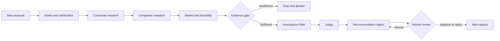

# Build or Bust

**An evidence-backed AI product discovery agent that turns a product idea into a
BUILD, VALIDATE, PIVOT, or BUST decision.**

Build or Bust collects a product proposal, fills missing intake details through
human clarification, researches the opportunity, checks whether the evidence is
strong enough to continue, challenges critical assumptions, and produces a
decision with measurable validation actions.

The application is built with Python, Streamlit, LangGraph, Nebius Token Factory,
You.com MCP tools, and SQLite.

## What it does

- Normalizes a raw idea into product, customer, geography, problem, and product type.
- Pauses for human clarification when required intake fields are missing.
- Researches consumers, competitors, market demand, and technical feasibility.
- Applies a deterministic evidence gate before model-generated conclusions.
- Stops with `INSUFFICIENT_EVIDENCE` when source quality or coverage is too weak.
- Challenges consequential assumptions using only collected evidence.
- Returns one explicit decision: `BUILD`, `VALIDATE`, `PIVOT`, or `BUST`.
- Generates recommended actions and validation experiments.
- Pauses for human approval or rejection.
- Saves checkpoints so interrupted evaluations can resume without restarting.
- Reuses recent completed evaluations when the normalized idea matches.

## Decision pipeline



The evidence gate is intentionally separate from the Judge. Source counts,
independent-domain counts, required topic coverage, and competitor page extraction
determine whether the question is answerable before the model is asked to decide.

## Decision meanings

| Decision | Meaning |
| --- | --- |
| `BUILD` | Evidence supports proceeding with a constrained initial build. |
| `VALIDATE` | The opportunity is plausible, but important assumptions need testing. |
| `PIVOT` | The problem may be valuable, but the proposed direction should change. |
| `BUST` | Evidence reveals a fatal flaw or contradicts the core opportunity. |

## Technology

| Layer | Technology |
| --- | --- |
| Interface | Streamlit |
| Workflow orchestration | LangGraph |
| Structured generation | Nebius Token Factory |
| Web research | You.com MCP |
| Validation | Pydantic and deterministic evidence checks |
| Checkpoints and local registry | SQLite |
| Tests | Pytest with fake model and research collaborators |

## Local setup

Requirements: Python 3.11 or newer. The project is currently tested with Python
3.13.

```powershell
py -m venv .venv
.venv\Scripts\Activate.ps1
pip install -e ".[dev]"
Copy-Item .env.example .env
```

Add your credentials to `.env`:

```text
NEBIUS_API_KEY=your_key
NEBIUS_BASE_URL=https://api.tokenfactory.nebius.com/v1/
NEBIUS_MODEL=Qwen/Qwen3-30B-A3B-Instruct-2507
YDC_API_KEY=your_key
YOU_MCP_URL=https://api.you.com/mcp?tools=you-search,you-contents,you-research
CHECKPOINT_DB=build_or_bust.db
PUBLIC_DEMO_MODE=false
```

Never commit `.env` or `.streamlit/secrets.toml`. Both are ignored by Git.

## Run the Streamlit interface

```powershell
streamlit run src/build_or_bust/ui.py
```

Open `http://localhost:8501` and submit a product idea. The result page includes:

- the original and normalized product proposal;
- a color-coded Judge ruling and confidence score;
- decision criteria and evidence-readiness gauges;
- expandable consumer, competitor, and market research;
- recommendation and validation-experiment cards; and
- approve or reject human review.

The URL contains the LangGraph thread ID after an evaluation starts. Reopening
`http://localhost:8501/?thread=THREAD_ID` restores the checkpoint without repeating
completed research calls.

## Command-line interface

Start an evaluation:

```powershell
build-or-bust "A mobile app that helps busy US parents plan weeknight meals"
```

Resume a clarification:

```powershell
build-or-bust --thread YOUR_THREAD_ID --resume "The first market is Canada"
```

Submit human review:

```powershell
build-or-bust --thread YOUR_THREAD_ID --review approve --notes "Proceed"
build-or-bust --thread YOUR_THREAD_ID --review reject --notes "Risk is too high"
```

Choose whether to reuse an exact recent evaluation:

```powershell
build-or-bust --thread YOUR_THREAD_ID --prior reuse
build-or-bust --thread YOUR_THREAD_ID --prior refresh
```

## Tests

The test suite uses fake API collaborators and does not call live model or research
providers.

```powershell
pytest
```

Current result: **35 tests passing**.

## Deploy a public cohort demo

The repository includes `requirements.txt`, `.streamlit/config.toml`, and a safe
secrets template for Streamlit Community Cloud.

1. Push the repository to GitHub.
2. Sign in at [share.streamlit.io](https://share.streamlit.io).
3. Create an app from the GitHub repository.
4. Set the entrypoint to `src/build_or_bust/ui.py`.
5. Select Python 3.13 in Advanced settings.
6. Paste `.streamlit/secrets.toml.example` into the Secrets field and replace both
   API-key placeholders.
7. Deploy and share the generated `streamlit.app` URL.

With `PUBLIC_DEMO_MODE=true`, the public app hides evaluation history and disables
cross-visitor idea lookup and reuse. Thread checkpoints continue to work while the
deployed instance remains running.

### Public-demo limitations

- Streamlit Community Cloud does not guarantee persistence of the local SQLite file.
- Checkpoints may disappear after a restart or redeployment.
- Each new evaluation uses paid Nebius and You.com API calls.
- Configure provider spending and request limits before sharing the URL publicly.
- Use a hosted database and stronger abuse controls before treating the app as a
  production service.

## Project structure

```text
src/build_or_bust/
├── ui.py                     Streamlit interface and checkpoint restoration
├── cli.py                    Command-line interface
├── graph.py                  LangGraph nodes, routing, interrupts, and persistence
├── state.py                  Shared workflow state
├── extractor.py              Nebius structured intake extraction
├── consumer_research.py      You.com MCP consumer evidence
├── competitor_research.py    Competitor and pricing evidence
├── market_feasibility.py     Demand, adoption, dependency, and feasibility evidence
├── evidence_gate.py          Deterministic answerability checks
├── assumption_killer.py      Critical-assumption analysis
├── judge.py                  BUILD, VALIDATE, PIVOT, or BUST decision
├── recommendation.py         Actions and validation experiments
├── idea_registry.py          Completed-evaluation storage and exact-match reuse
└── dashboard.py              Confidence and evidence-readiness scores
```

## Current scope

This is a cohort demonstration and learning project. It is designed to make evidence
quality, abstention, workflow state, model failures, and human review visible rather
than hiding them behind a single model response.
